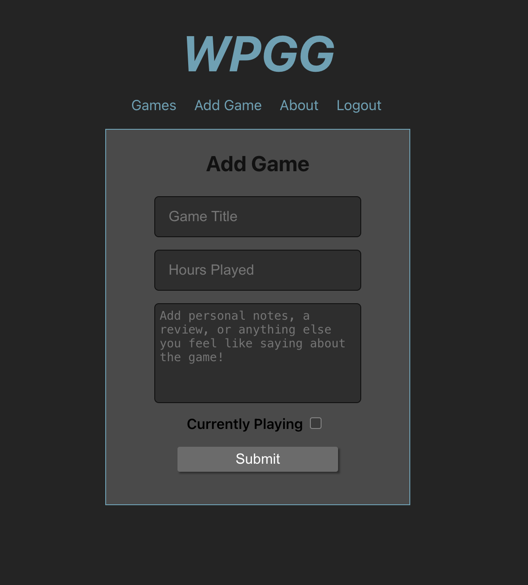
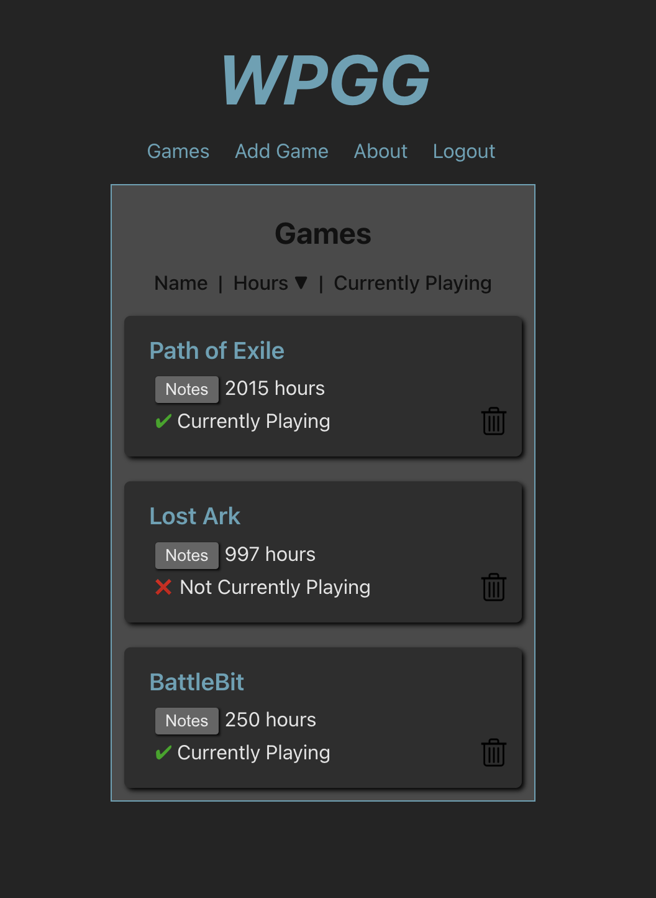

# Wise Play Game Grove (WPGG)

Full stack CRUD application created to help PC gamers keep track of the games in their Steam library. 

After registering and logging in, users can manually add the games they wish to track to the database using the `Add Game` form. Games added to the database will be displayed on the `Games` page. Games can be easily removed from the database.

Users can also attach notes to each game. These notes can contain a review of the game, reasons why a user is playing or isn't playing a certain game, or any other reminders or personal information. Notes can easily be updated or deleted.

## Preview

 

 

## Stretch Goals (in progress): 

After login / authorization is added to the application, allow users to connect their steam account to the app.

Once games have been added, users will be able to "Get Hours" which will make a call to the Steam API to update the hours played of the games that have been added (if they are also in the user's Steam Game Library).

Pull the cost of each game from the Steam API and calculate the amount of hours per dollar of each game.
